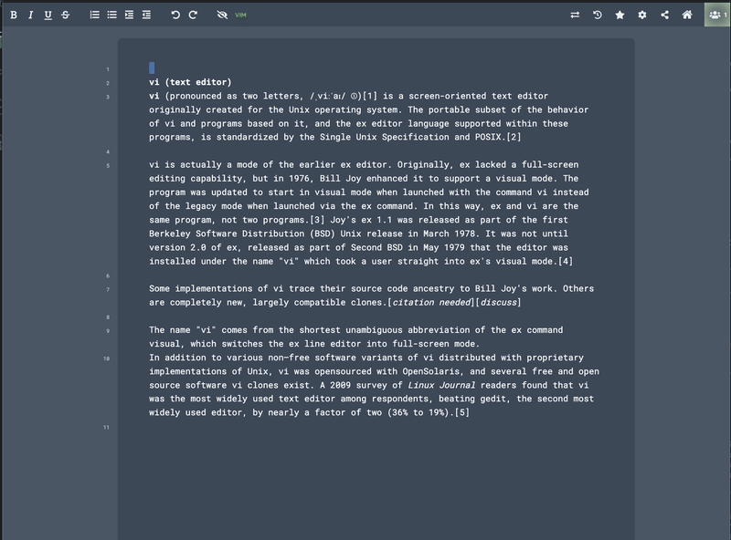

# ep_vim

[](https://www.npmjs.com/package/ep_vim)
[](https://github.com/Seth-Rothschild/ep_vim)
[](https://www.gnu.org/licenses/gpl-3.0)

A vim-mode plugin for [Etherpad](https://etherpad.org/). Adds modal editing with normal, insert, and visual modes to the pad editor.  Mostly vibe coded with [Claude Code](https://claude.ai/claude-code).



## Features

- **Modal editing** — normal, insert, and visual (char + line) modes; visual selections support all operators (`d`, `c`, `y`)
- **Motions** — `h` `j` `k` `l`, `w` `b` `e`, `0` `$` `^`, `gg` `G`, `f`/`F`/`t`/`T` char search, `{` `}` paragraph forward/backward, `H` `M` `L` viewport (top/middle/bottom)
- **Char search** — `f`/`F`/`t`/`T` find, `;` repeat last search, `,` reverse direction
- **Bracket matching** — `%` jump to matching bracket
- **Text objects** — `iw`/`aw` (word), `i"`/`a"` and `i'`/`a'` (quotes), `i{`/`a{` etc. (brackets), `ip`/`ap` (paragraph), `is`/`as` (sentence)
- **Operators** — `d`, `c`, `y` with motion and text object combinations (`dw`, `ce`, `y$`, `ciw`, `da"`, `yi(`, etc.)
- **Line operations** — `dd`, `cc`, `yy`, `D`, `J` (join), `Y` (yank line)
- **Registers** — `"a`–`"z` named registers for yank/delete/put, `"_` blackhole register
- **Put** — `p` / `P` with linewise and characterwise register handling
- **Editing** — `i` `a` `A` `I` (insert/append), `x`, `X`, `r`, `s`, `S`, `C`, `o`, `O`, `~` (toggle case)
- **Marks** — `m{a-z}` to set, `'{a-z}` / `` `{a-z} `` to jump
- **Search** — `/` and `?` forward/backward, `n`/`N` repeat, `*`/`#` search word under cursor
- **Scrolling** — `zz`/`zt`/`zb` center/top/bottom, `Ctrl+d`/`Ctrl+u` half-page, `Ctrl+f`/`Ctrl+b` full-page (requires ctrl keys enabled)
- **Visual** — `v` char, `V` line, `gv` reselect last selection; `~` toggle case in visual
- **Repeat** — `.` repeat last command
- **Counts** — numeric prefixes work with motions and operators
- **Undo/redo** — `u` undo, `Ctrl+r` redo (requires ctrl keys enabled)
- **Toggle** — toolbar button to enable/disable vim mode, persisted in localStorage; settings panel for system clipboard and ctrl key behavior

## Differences from vi
The following are not planned, but PRs are welcome.

- **No command line, macros, or globals** 
- **No visual block mode**  
- **No indentation operators** — `>>`, `<<`, and `>` / `<` in visual mode
- **No increment/decrement** — `Ctrl+a` and `Ctrl+x` 

## Installation

From your Etherpad directory run

```
pnpm run plugins install ep_vim
```


## License

GPL-3.0
